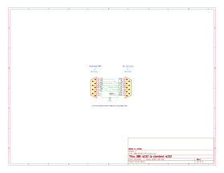
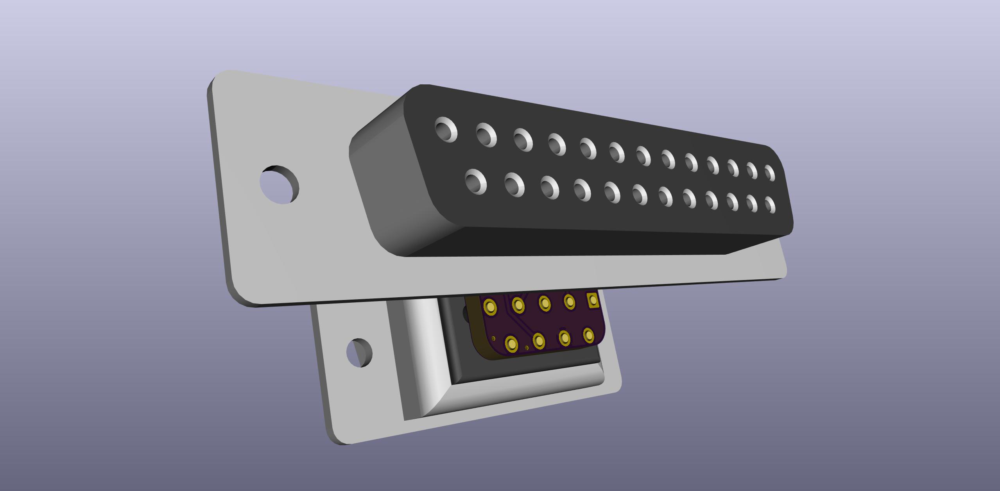
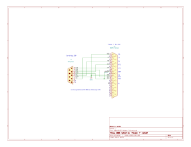

# Cambridge Z88 serial port adapters

## PC style
  

PCB: https://oshpark.com/shared_projects/w1GYezbu  
BOM: https://www.digikey.com/short/zfdrnv

Z88_RS232_PC converts the Z88 serial port to a PC style com port.  
DE9M with standard RS-232 DTE pinout.

This adapter is most convenient for using peripherals designed for use with a standard PC or USB-Serial adapter, or a 9-pin null-modem cable to a PC.

## "Model T" style
  
  

PCB: https://oshpark.com/shared_projects/cCj4Skb4  
BOM: https://www.digikey.com/short/zfdrnz

Z88_RS232_Model_T converts the Z88 serial port to a "Model T" style serial port.  
DB25F with standard RS-232 DTE pinout.

This is not like most hosts or devices today, in that normally a DTE or host port is a male plug, but it's otherwise still conforming to the rs232 standard in that the correct rs-232 signals are on the correct pin numbers. It's only the female connector that's unusual.

"Model T" computers are: TRS-80/TANDY Models 100, 102, 200, 600, NEC Models PC-8201, PC-8201A, PC-8300, Olivetti M10, and Kyotronic KC-85. All of these machines have a DB25F connectore with a RS-232 DTE pinout.

This adapter is most convenient for using peripherals designed for use with "Model T" computers, for instance the Tandy Portable Disk Drive.

You could connect to a PC with this adapter too, by using the same slightly uncommon kind of cable that a "model T" would need.  
http://tandy.wiki/Model_T_Serial_Cable
